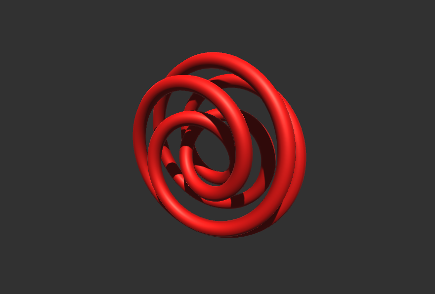

# Knots

## Main reference
http://paulbourke.net/geometry/knots/

## Writeup

Wikipedia:

    In mathematics, a knot is an embedding of a topological circle S1 in 3-dimensional Euclidean space, R3 (also known as E3), considered up to continuous deformations (isotopies).

But they do look cool. Essentially they are implemented as a parametric function of a single variable **F** which goes, in this case, from 0 to 2π. At every step of its way from 0 to 2π, the function tells you how to calculate the XYZ coordinates based on the value of F.

See the main reference for concrete equations.

## Triangulating
These equations give you the points of the knot. Like a spline. In order to triangulate it, I calculated the surface normal at each point and generated X vertices in a normal-aligned circumference. 

Essentially, this method generates a continous pipe based on a spline.

It was then just a matter of linking these vertices together to make a mesh.

# Renders

## Animation
## [Youtube Link](https://www.youtube.com/watch?v=3tbUSpIiOCI)
Just messing around with knots of different sizes. 

## Single Knots

